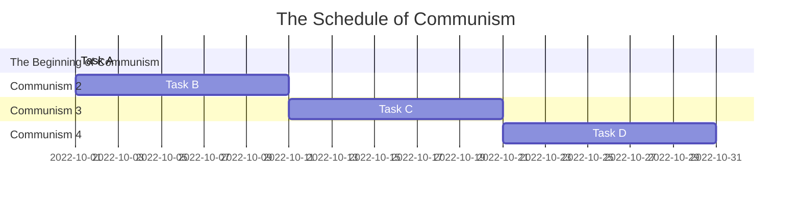
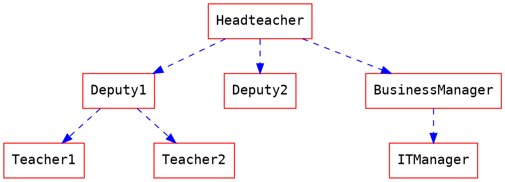

# Group5
***
| 小組定位      | 學號             |姓名      | 工作內容    |
| :----------- | :--------------- | :------ | :---------- |
| 組長         | C109118220 |[胡世堯](https://github.com/SHIH-yao) |資料蒐集、資料處理、 內容編整|
| 組員         | C109118212 |[薛至斌](https://github.com/angus426)   |統整討論資料、影片拍攝、影片剪輯|
| 組員         | C109118231 |[廖宇蓁](https://github.com/yuzhena) |內容編整、問卷製作、發放問卷|
| 組員         | C109118233 |[李文馨](https://github.com/C109118233) |統整討論資料、簡報製作|
| 組員         | C109118237 |[潘姿妤](https://github.com/Zhiyupan237) |程式編寫、程式除錯|
***
# 專案規劃表
| 編號 | 說明 | 需時(天) | 前置任務 |
| :--: | :---| :------: | :-----: |
|1|討論專案題目|1||
|2|討論工作分配|1|1|
|3|
|4|
|5|
|6|
|7|
|8|
|9|
### Mermaid

