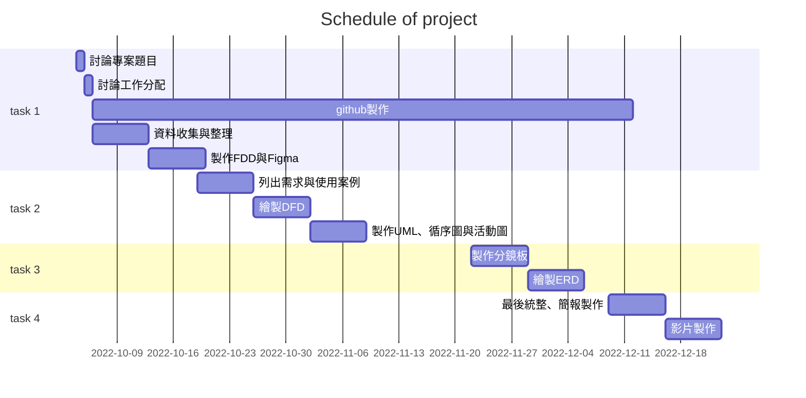
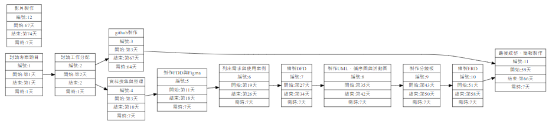

# Group3 星巴克自動點餐系統
***
| 小組定位      | 學號             |姓名      | 工作內容    |
| :----------- | :--------------- | :------  | :---------- |
| 組長         | C109118220 |[胡世堯](https://github.com/SHIH-yao)   |討論功課、影片製作、上台報告|
| 組員         | C109118212 |[薛至斌](https://github.com/angus426)   |討論功課、最後統整、製作Github|
| 組員         | C109118231 |[廖宇蓁](https://github.com/yuzhena)    |討論功課、最後統整、製作Github|
| 組員         | C109118233 |[李文馨](https://github.com/C109118233) |討論功課、資料蒐集、製作簡報|
| 組員         | C109118237 |[潘姿妤](https://github.com/Zhiyupan237)|討論功課、影片製作、上台報告|
***
# 專案規劃表
| 編號 | 說明 | 需時(天) | 前置任務 | 完成日期 |
| :--: | :---| :------: | :-----: | :-----: |
|1|討論專案題目|1||10/04|
|2|討論工作分配|1|1|10/05|
|3|github製作|84|2|12/28|
|4|資料搜集與整理|7|2|10/12|
|5|製作FDD與Figma|7|4|10/19|
|6|列出需求與使用案例|7|5|10/26|
|7|繪製DFD|7|6|11/3|
|8|製作UML、循序圖與活動圖 |7|7|11/9|
|9|製作分鏡板|7|8|11/29|
|10|繪製ERD|7|9|12/6|
|11|最後統整、簡報製作|7|10|12/13|
|12|影片製作|7|11|12/25|

# Gantt chart
### Mermaid

# PERT Diagram

