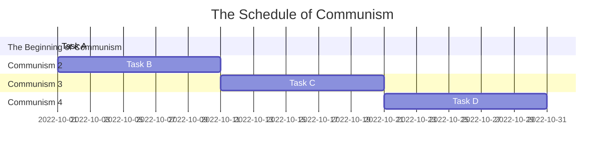
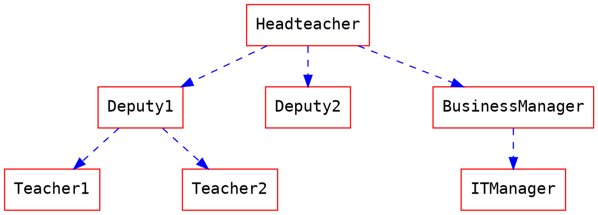

# Group5
***
| Position     | Member             | Work     |
| :----------- | :---------------| :---------- |
| 組長         | C109118214 [朱晉瑭](https://github.com/C109118214) |資料蒐集、資料處理、 內容編整|
| 組長         | C109118226 [林志穎](https://github.com/ZYLinked) |  統整討論資料、影片拍攝、影片剪輯|
| 組長         | C109118227 [謝岷翰](https://github.com/C109118227) |內容編整、問卷製作、發放問卷|
| 組長         | C109118236 [劉　議](https://github.com/C109118236) |統整討論資料、簡報製作|
| 組長         | C109118244 [袁祥竣](https://github.com/C109118244) |程式編寫、程式除錯|
***

### Mermaid

