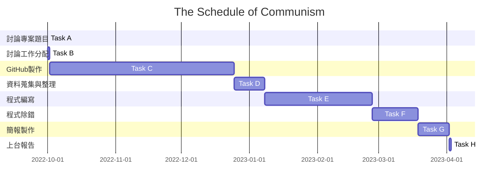

# Group5
***
| 小組定位      | 學號             |姓名      | 工作內容    |
| :----------- | :--------------- | :------  | :---------- |
| 組長         | C109118220 |[胡世堯](https://github.com/SHIH-yao)   |程式編寫、程式除錯、上台報告|
| 組員         | C109118212 |[薛至斌](https://github.com/angus426)   |程式編寫、程式除錯、製作Github|
| 組員         | C109118231 |[廖宇蓁](https://github.com/yuzhena)    |程式編寫、程式除錯、製作Github|
| 組員         | C109118233 |[李文馨](https://github.com/C109118233) |程式編寫、程式除錯、製作簡報|
| 組員         | C109118237 |[潘姿妤](https://github.com/Zhiyupan237)|程式編寫、程式除錯、上台報告|
***
# 專案規劃表
| 編號 | 說明 | 需時(天) | 前置任務 | 完成日期 |
| :--: | :---| :------: | :-----: | :-----: |
|1|討論專案題目|1||10/04|
|2|討論工作分配|1|1|10/05|
|3|github製作|84|2|
|4|資料搜集與整理|14|2|
|5|程式編寫|49|4|
|6|程式除錯|21|5|
|7|簡報製作|14|3、5|
|8|上台報告|1|7|

### Mermaid

