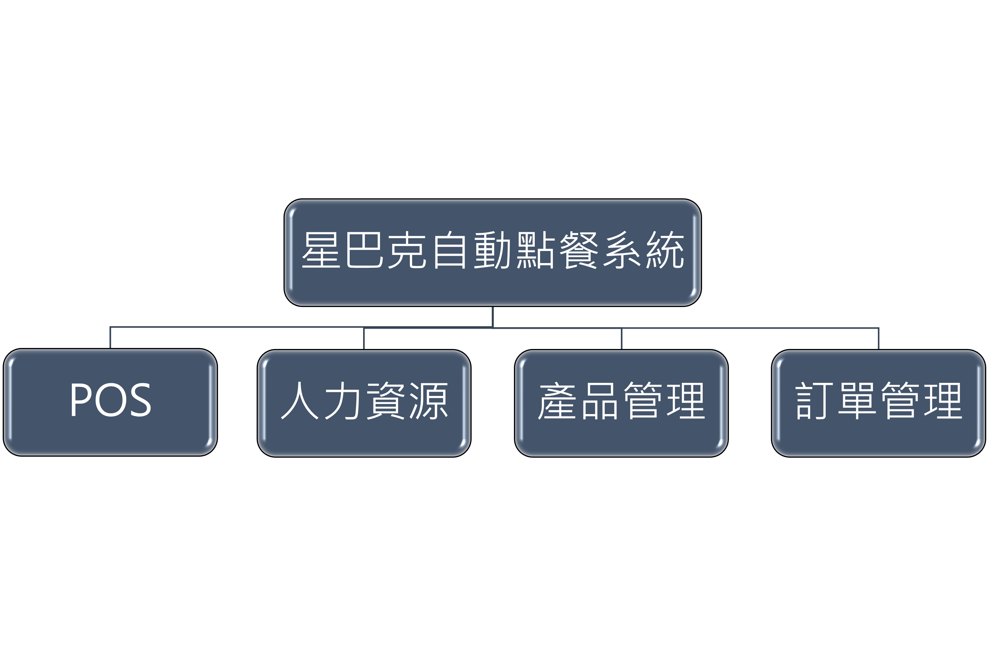

## 功能性需求與非功能性需求

### 功能性需求:
  點餐、出餐、結帳
### 非功能性需求:
  >1. 可靠性:對於整體資料排序方式採自訂方式，且能自動備份。
  >2. 開放原始碼:可以生產模組、通訊管道、且互動社群能加以改善。
  >3. 資安(隱私權):定期委外執行滲透測試，確保系統與資料庫安全
  >4. 可維護性:有異常事件時，會寄送訊息通知管理人員
  >5. 使用性:使用者介面清晰，功能簡單易懂

---
## 功能分解圖 FDD  
 

---
## 需求分析的文字描述
>1. 顧客能藉由使用點餐系統進行點餐
>2.	每筆訂單完成結帳後需即時更新可供應(available)的餐點
>3.	能藉由購物車對訂單進行增加、刪除、修改
>4.	於結帳畫面能查看詳細訂單內容與總金額

---
## 使用案例說明

|使用案例名稱 |點餐系統|
|:-----------|:---------------|
|行動者|使用者|
|說明|描述顧客自助點餐過程|
|完成動作|1.顧客選擇餐點、份數     2.確認購物車內容與訂購資料  3.顯示訂單明細並送出   |
|替代方法|1.顧客選擇餐點、份數 2.確認購物車內容與訂購資料 3.顯示訂單送出失敗(餐點分量不足or訂購資料有誤) |
|先決條件|顧客至少選擇一樣商品進入結帳|
|後置條件|交易成功，請等待餐點到來|
|假設|本日有營業|

|使用案例名稱 |後台管理|
|:-----------|:---------------|
|行動者|管理者|
|說明|描述餐點管理|
|完成動作|1.管理者輸入帳號密碼登入後臺     2.選擇商品  3.選擇要上架或下架此商品  4.系統告知修改成功 |
|替代方法|1.管理者輸入帳號密碼登入後臺     2.選擇商品  3.選擇要上架或下架此商品  4.系統告知修改錯誤 |
|先決條件|管理者需要先有帳號和密碼並登入後台|
|後置條件|管理者可以無限修改|
|假設|無|

|使用案例名稱 |帳單管理|
|:-----------|:---------------|
|行動者|管理者|
|說明|產生報表提供給經理參考|
|完成動作|1.將每日存貨變動與銷售額匯總     2.產出營業報表  3.交給經理作為決策參考   |
|替代方法|1.若與實際情況不符，以實際存貨與銷售額為準  2.重新統計後產出營業報表 3.交給經理作為決策參考 |
|先決條件|有成功交易紀錄|
|後置條件|產出報表|
|假設|無|

---
## Figma 動態模擬畫面
*  [Figma網址](https://www.figma.com/file/UIRADjn9YSrc56GXixEScT/Food-Ordering-App-(Community)?node-id=0%3A1)
